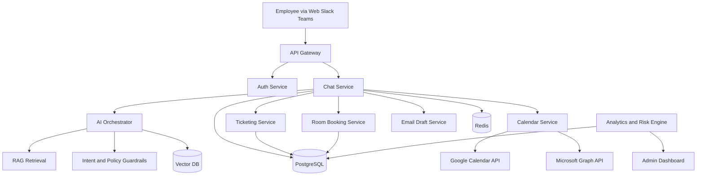
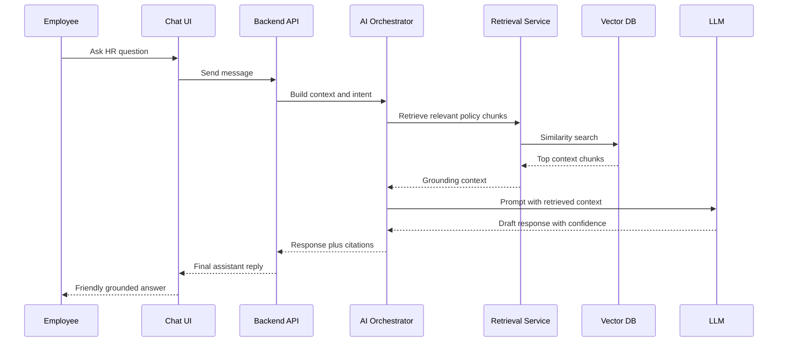
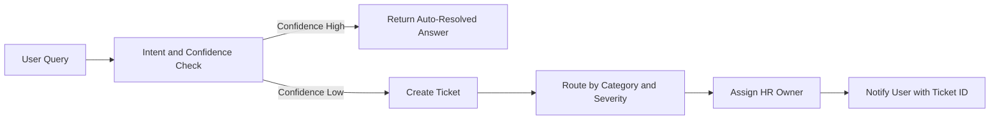
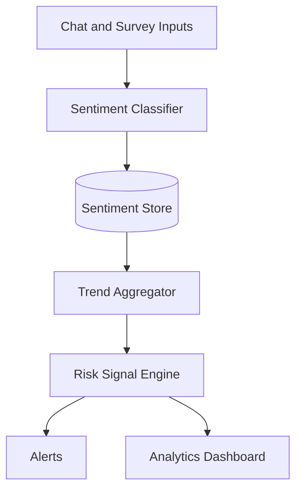
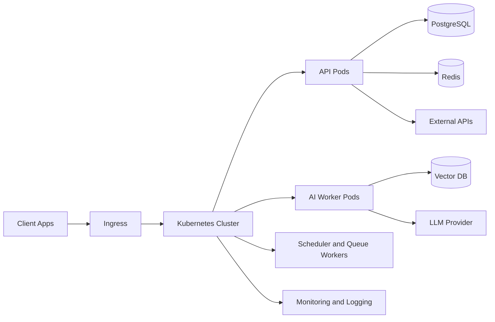

# AI Workplace Assistant
## Architecture Diagrams (Mermaid)

Version: 1.0  
Date: March 27, 2026

## 1. High-Level System Architecture

## 2. Chat and RAG Sequence

## 3. Low-Confidence Escalation Flow

## 4. Sentiment and Risk Pipeline

## 5. Deployment View

