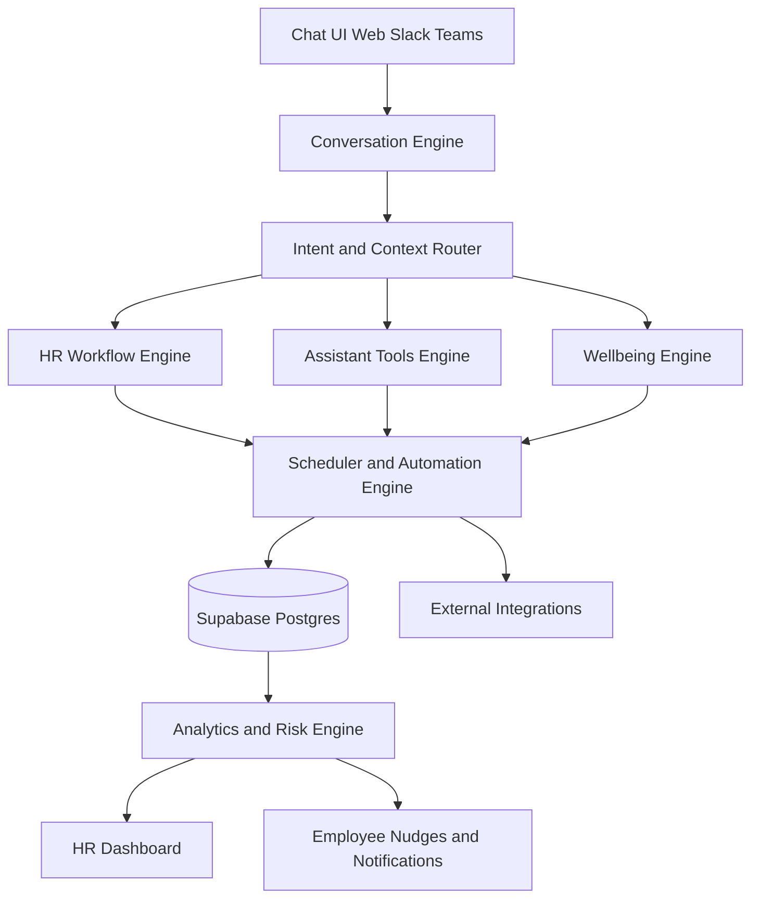

# MARK Intelligent Workplace Agent
## Product and System Design

Version: 1.1  
Date: April 15, 2026  
Status: Design Baseline for Execution

## 1. Product Definition

MARK is a proactive AI workplace companion for employees that combines:

- HR automation (transactional workflows)
- Daily work assistance (productivity tools)
- Wellbeing support (empathetic and preventive)
- Intelligence and prediction (risk and trend analytics)

This is not a question-answer chatbot. MARK observes behavior, detects patterns, and acts safely before issues escalate.

MARK is the HR that employees wish they had: trusted, consistent, and action-oriented.

## 1.1 Friendly HR Definition (Behavior Contract)

### A. Personality and Tone

- Warm, calm, respectful, non-judgmental, emotionally aware.
- Short, natural messages.
- One question at a time.
- Acknowledge emotion first, then act.
- Avoid corporate or form-like wording.

### B. Core Responsibilities

- HR operator: complaints, leave, payroll queries, policies, documents.
- Trusted listener: validates concerns without judgment and respects privacy.
- Memory-driven companion: remembers prior concerns, sentiment trends, and preferences.
- Workflow executor: creates tickets, applies leave, schedules support actions.
- Wellbeing checker: detects stress, burnout, silence, and follows up with care.

### C. Conversation Modes

- Action mode: fast, structured, completion-focused.
- Support mode: empathetic, open-ended, low-pressure.
- Assistant mode: smart, concise help for productivity tasks.

### D. Conversation Principles

- Intent first.
- Ask only missing information.
- Never repeat answered questions.
- Complete workflows end-to-end.
- Be human and emotionally grounded.

### E. System Loop

Listen -> Understand -> Ask -> Act -> Learn -> Follow-up

## 2. Product Positioning

### 2.1 Category

AI Workplace Companion

### 2.2 Positioning Statement

MARK unifies HR self-service, productivity assistance, wellbeing coaching, and organizational intelligence into one agent that understands context, takes action, and helps both employees and HR teams.

### 2.3 Differentiation

- Traditional HR chatbot: reactive, intent-in/answer-out.
- MARK: proactive, context-aware, automation-driven, risk-aware.

## 3. Capability Layers

## 3.1 Layer 1: HR Automation (Foundation)

Core enterprise workflows:

- Tickets (create, track, escalate)
- Leave management
- Payroll FAQ and basic support
- Policies and compliance Q&A
- Document retrieval and references

Design goal: high-confidence automation for repetitive HR operations.

## 3.2 Layer 2: Workplace Assistant

Daily productivity support around employee intent.

### A. Nearby Services

- Example: "Find lunch nearby"
- Input: office location or user location context
- Processing: maps/places query + ranking
- Output: nearby options with distance, rating, quick links

### B. Meeting Room Booking

- Example: "Book meeting room at 3 PM"
- Processing: availability check, conflict handling, reservation write-back
- Output: booking confirmation or alternatives

### C. Calendar Scheduling

- Example: "Schedule meeting with John tomorrow"
- Processing: participant availability, slot suggestion, invite creation
- Output: confirmed event details

### D. Lunch Menu Assistant

- Example: "What's for lunch today?"
- Processing: cafeteria API or static menu source
- Output: menu by meal and dietary tags

### E. Draft Emails

- Example: "Draft email to manager about delay"
- Processing: intent + recipient + tone + context
- Output: structured draft (subject, body, call-to-action)

## 3.3 Layer 3: Wellbeing and Human Support

The primary product differentiator.

### A. Friendly Daily Interaction

- Warm check-ins and natural prompts
- Human and respectful tone by default

### B. Smart Reminders

- Break reminders from activity signals
- Meeting reminders from calendar context
- Custom reminders (for example, medicine)

### C. Emotional Support

- Detect stress signals from conversation sentiment and wording
- Respond with empathy and supportive follow-up options
- Optional, policy-controlled HR escalation when risk threshold is crossed

### D. Health Assistant

- User-defined reminders with schedule and acknowledgement tracking

## 3.4 Layer 4: Intelligence Engine

Background analytics and risk prediction.

- Behavior tracking: chat frequency, inactivity windows, response delays, sentiment trend
- Silent employee detection: low interaction and prolonged inactivity
- Burnout detection: negative sentiment + sustained high activity duration
- Attrition risk: low engagement + unresolved issues + complaint signals

## 4. System Architecture

## 4.1 High-Level Flow

## 4.2 Core Runtime Components

- Conversation Engine: session state, context persistence, response orchestration
- Intent and Context Router: intent classification, entity extraction, tool routing
- HR Workflow Engine: leave, policy, ticket, payroll-support operations
- Assistant Tools Engine: calendar, room, nearby services, lunch, email drafting
- Wellbeing Engine: sentiment scoring, empathy response strategy, wellbeing events
- Scheduler and Automation Engine: periodic rules, event-based triggers, notifications
- Analytics and Risk Engine: trend generation, risk scoring, HR summary outputs

## 5. Proactive Automation Design

Reactive-only mode is insufficient. MARK requires rule-driven proactive actions.

## 5.1 Rule Catalog

### Rule 1: Break Reminder

- Trigger: active work session > 2.5 hours without break event
- Action: send supportive break nudge
- Channel: in-app message, optional push

### Rule 2: Negative Sentiment Alert

- Trigger: sentiment below configured threshold or distress language pattern
- Action: suggest supportive follow-up to employee
- Action (optional): create HR alert based on org policy

### Rule 3: Silent Employee Nudge

- Trigger: no chat/activity for configured inactivity window
- Action: send low-friction check-in prompt

### Rule 4: Weekly HR Summary

- Trigger: scheduled batch job (for example, Monday 09:00 local)
- Action: generate summary with top issues, risk employees, and engagement trend

## 5.2 Automation Execution Model

- Event ingest: activity events and conversation events stored in DB
- Rule evaluation: scheduled and event-driven workers
- Decision logging: each automation decision is auditable
- Notification dispatch: idempotent sender with retry policy

## 6. Data Model and Signals

## 6.1 Existing Core Entities (Repository-Aligned)

- users
- conversations
- conversation_messages
- conversation_memory
- tickets
- hr_alerts
- chat_feedback

## 6.2 Required Signal Entities

- activity_events
  - user_id, event_type, source, occurred_at, metadata_json
- reminder_schedules
  - user_id, reminder_type, cron_or_time, timezone, status, payload_json
- wellbeing_signals
  - user_id, sentiment_score, stress_flag, confidence, computed_at
- risk_snapshots
  - user_id, burnout_score, attrition_score, engagement_score, computed_at
- automation_actions
  - rule_name, user_id, action_type, action_payload, status, created_at

## 6.3 Derived Metrics

- Engagement score
- Mood score
- Activity level
- First response latency
- Feedback response volume
- Department sentiment trend

## 7. Integration Architecture (Layer 2)

## 7.1 Integration Adapters

- Maps adapter (nearby services)
- Calendar adapter (Google/Microsoft/internal)
- Room booking adapter (internal scheduling service)
- Cafeteria menu adapter (API/file feed)
- Email draft adapter (LLM-based generation)

## 7.2 Integration Contract Pattern

- Standard request envelope: intent, entities, user_context, trace_id
- Standard response envelope: status, result, confidence, fallback_reason
- Retry with backoff and circuit breaker for external failures

## 8. HR Dashboard Final Output

## 8.1 Overview KPIs

- Engagement score
- Mood score
- Activity level

## 8.2 Alert Panels

- High-risk employees
- Burnout signals
- Unresolved complaint or ticket clusters

## 8.3 Trend Panels

- Department sentiment trends
- Manager effectiveness indicators
- Top recurring issues

## 8.4 Employee Risk Table

Columns:

- Name
- Mood
- Risk
- Open tickets
- Last active

## 9. Safety, Privacy, and Governance

- Role-based access controls for sensitive views
- Policy-gated HR escalation for wellbeing signals
- Data minimization for emotional signals
- Explainable risk signals (feature contributions, not black-box outputs)
- Audit trail for proactive automations and dashboard actions

## 10. Non-Functional Requirements

- Availability target: 99.9% for core assistant APIs
- P95 response latency: < 5 seconds for common flows
- Automation reliability: at-least-once execution with idempotent actions
- Observability: traces, metrics, structured logs, alerting
- Security: JWT/RBAC, rate limits, PII masking in logs

## 11. Execution Plan by Layer

## Phase A (Current Baseline)

- HR automation core
- sentiment and alerts baseline
- CSAT and weekly quality analytics
- memory cards and friendly assistant behavior

## Phase B (Next)

- Nearby services
- calendar scheduling
- room booking
- lunch menu integrations
- advanced email drafting workflow

## Phase C (Differentiator Hardening)

- robust proactive rule engine
- configurable HR policy workflows for escalations
- expanded risk scoring and explainability
- weekly executive summaries and drill-down insights

## 12. Repository Mapping (Implementation Anchors)

Backend modules to evolve:

- app/api/v1/chat.py
- app/api/v1/analytics.py
- app/api/v1/feedback.py
- app/services/dashboard_analytics.py
- app/services/memory_service.py
- app/services/scheduler.py

Frontend modules to evolve:

- frontend/src/components/ChatPanel.tsx
- frontend/app/dashboard/page.tsx
- frontend/src/lib/hr-data.ts
- frontend/app/api/chat/*

This mapping keeps execution grounded in current code structure rather than introducing a parallel architecture.
